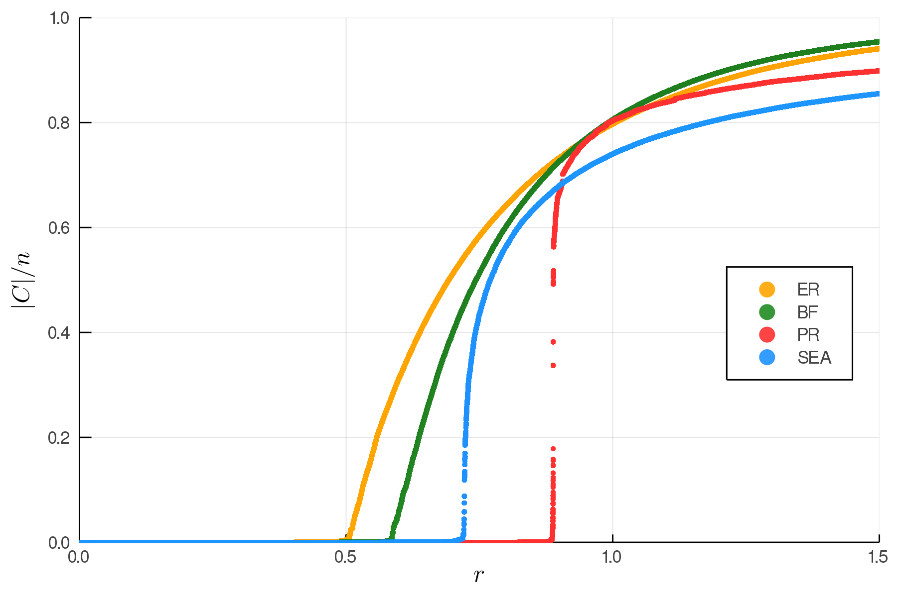

# Explosive Percolation

I am currently writing my bachelor's thesis in the computational physics group at Universität Leipzig under the supervision of Prof. Dr. Wolfhard Janke and Dr. Stefan Schnabel.
Percolation theory is a subject with a range of applications, and can be used to help model phase transitions in systems where there is an underlying graph, e.g. a lattice or random network.
Phase transitions are of great interest in physics as we often study systems which have different phases, such as a ferromagnets which have an ordered ferromagnetic phase at low temperatures and a disordered phase at high temperatures.

To be a bit more specific, I am working on explosive percolation, which entails processes where the graph evolves in such a way that the onset of percolation is delayed until a critical point where there is a sudden onset of large scale connectivity.
I have designed and am in the process of analyzing a model for accepting edges called stochastic edge acceptance, or SEA for short.

Illustrated in the plot below (system size $n = 10^6$) we can see the order parameter $|C| / n$ plotted against the relative number of edges present in the graph $r = t / n$ where $t$ is the total number of edges present.
* ER = Erdos-Renyi Model
* BF = Bohman-Frieze Model
* PR = Product Rule Model
* SEA = Stochastic Edge Acceptance Model

We can see that the BF, PR, and SEA models all exhibit phase transitions at a later point than the reference ER model, which has been proven to transition at $r = 0.5$. The PR and SEA models both exhibit a somewhat "explosive" transition, meaning that as soon as the phase transition begins the largest cluster enters a period of rapid growth.
