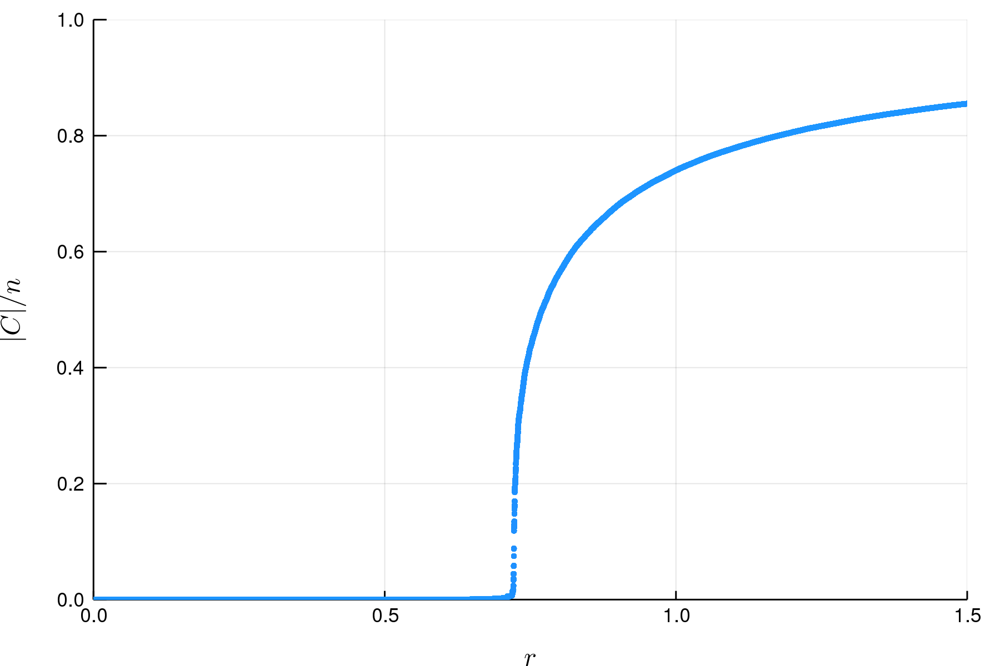

# Getting Started

## Usage
Here's an example of how to instantiate a `Network` type, evolve it using the `stochastic_edge_acceptance!` method, and plot the order parameter as a function of the relative number of edges.

```
julia> using Percolation

julia> using Plots; gr(fmt="png")

julia> g = Network(10^6);

julia> stochastic_edge_acceptance!(g, Int(1.5*10^6));

julia> x = collect(1:g.t) ./ g.n;

julia> y = g.observables.largest_cluster_size ./ g.n;

julia> plot_ = plot(dpi=300);

julia> scatter!(x, y,
           legend=false,
           marker=(2, :dodgerblue, :circle, 0.9, stroke(0)),
           xaxis=(latexstring("r"), (0, 1.5), 0:0.5:1.5),
           yaxis=(latexstring("|C|/n"), (0, 1), 0:0.2:1)
       );

julia> savefig(plot_, "/tmp/order_param.png")
```

This saves the figure:


